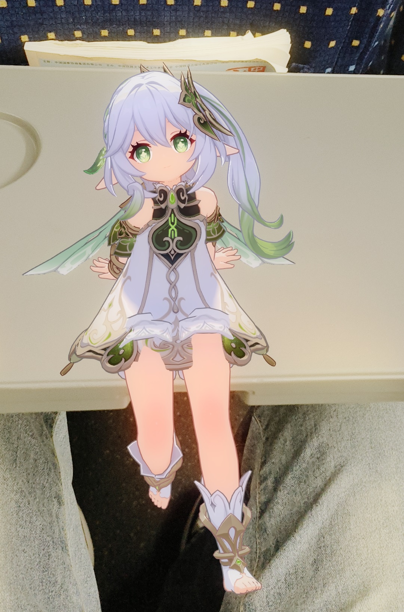
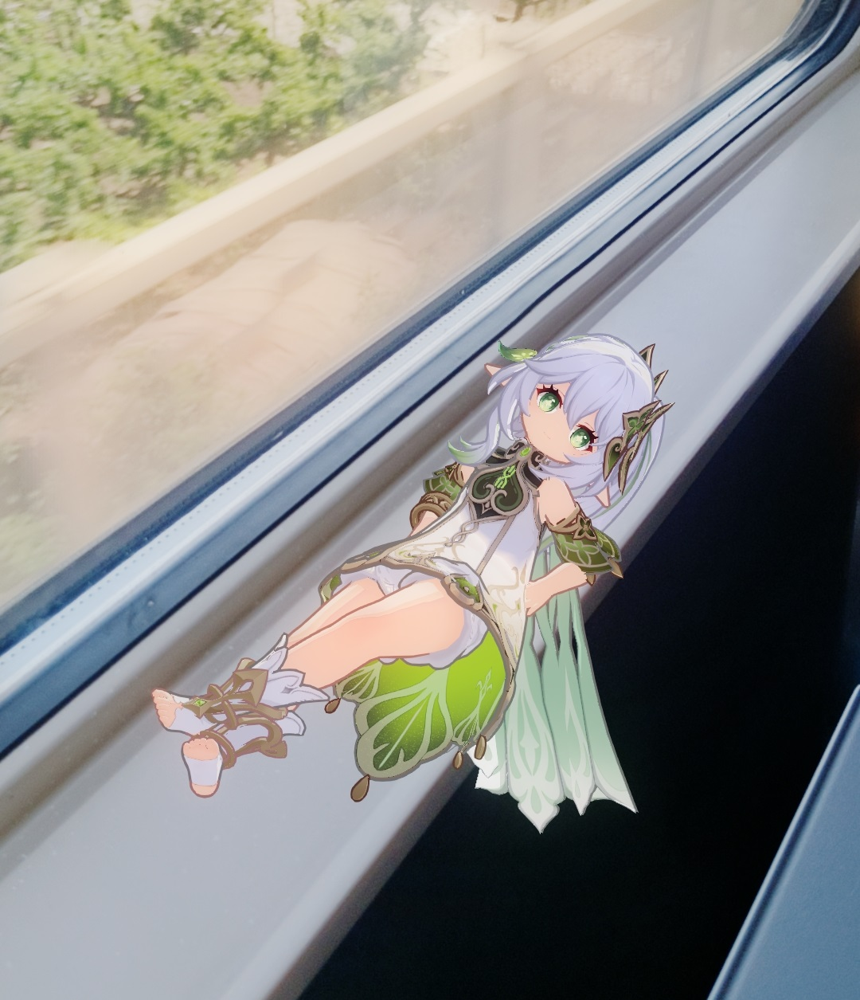

# 🪄✨ ARNahida

让虚拟角色陪你一起探索现实世界！

---

## 📢 使用必读

- **本项目仅供学习交流，严禁用于任何商业用途！**
- 模型与渲染资源来自 [NahidaRenderProject](https://github.com/kaze-mio/NahidaRenderProject)
- 动作资源来自 [Mixamo](https://www.mixamo.com/#/)

---

## 📱 前置条件

- 请确认你的手机在 [ARCore 支持设备名单](https://developers.google.cn/ar/devices?hl=zh-cn#android_china) 中哦~

---

## 🛠️ 项目环境

- Unity 2022.3.23f1c1
- 主要依赖：
  - AR Foundation 5.1.3
  - ARCore XR Plugin 5.1.6
  - 其他依赖详见 `Packages/manifest.json`

---

## 🗂️ 项目主要结构

```
ARNahida/
├── Assets/
│   ├── Scenes/         # 主要场景文件（如 ARNahida.unity）
│   ├── Scripts/        # 外部脚本
│   │   └── PlaceOnPlane.cs  # 负责在平面上放置/移动虚拟人物的魔法师
│   └── 资源/
│       └── 脚本/
│           ├── BlinkController1.cs     # 控制角色眨眼动画，让角色更有灵气
│           ├── IK.cs                   # 实现角色头部自动看向主摄像机，增强互动感
│           ├── PlayerMove.cs           # 角色主移动控制，支持动画驱动和直接移动
│           ├── FollowerMove.cs         # 跟随模式下的路径记录与角色自动跟随
│           ├── Recognition.cs          # 控制平面识别的开关与UI反馈
│           ├── Pattern.cs              # 各种模式（动画移动、跟随、手动移动等）的全局开关与状态管理
│           ├── SkipUnityLogo.cs        # 跳过Unity启动Logo，加快启动体验
│           ├── InputAttribute.cs       # 输入管理，统一处理摇杆/跟随等输入方式
│           └── UI/
│               ├── AnimPlay.cs         # 动画切换与播放控制
│               ├── AnimMove.cs         # 动画驱动的移动逻辑
│               ├── Follow.cs           # UI层的跟随逻辑
│               ├── GridDH.cs           # UI网格相关
│               ├── InstantiateOnButton.cs # 按钮点击生成对象
│               ├── LookAt.cs           # 控制UI或角色朝向
│               ├── MobilityPattern.cs  # 移动模式切换
│               ├── Move.cs             # UI层的移动控制
│               ├── Quit.cs             # 退出按钮逻辑
│               ├── Scale.cs            # 缩放控制
│               ├── Speed.cs            # 速度调节
│               ├── UIDH.cs             # UI显示/隐藏
│               ├── UISwitch.cs         # UI切换
│               └── ...                 # 其他UI相关脚本
└── ...
```

### 📝 主要脚本说明

- `PlaceOnPlane.cs`  
  这个脚本就是"召唤师"啦！它负责：
  - 监听你的每一次触摸，帮你把虚拟角色"召唤"到现实平面上。
  - 如果角色已经在场景里，再次点击就能让 TA"瞬移"到新位置。
  - 自动识别你是不是点在 UI 上，避免误操作。
  - 结合 Pattern 组件，支持手动移动、跟随等多种"魔法"控制方式。

---

## 🚀 快速上手

1. 克隆本仓库：
   ```bash
   git clone https://github.com/CHN-HelloWorld/ARNahida.git
   ```
2. 用 Unity Hub 打开项目。
3. 检查 AR Foundation 和 ARCore XR Plugin 是否已安装。
4. 打开 `Assets/Scenes/ARNahida.unity` 场景。
5. 连接 Android 设备，构建并运行。

---

## 🎮 使用指南

### 竖屏模式

1. **新增**  
   检测不到平面？没关系，点击按钮手动召唤角色！角色会出现在你视角的上方，记得把 TA 移动到你能看到的地方哦~

2. **跟随**  
   启用后，角色会跟着你移动，你去哪里，TA 就去哪里哦~（目前 TA 会一直在你身后，后续可以让 TA 站你身边陪你聊天！）

3. **移动模式**

   - **绝对移动（默认）**：角色会忠实地走你走过的每一步，适合慢慢散步。
   - **相对移动**：适合你"飞驰人生"时用，比如坐车、坐火车，TA 会努力追上你的脚步！

4. **朝向**  
   让角色一直看着你，随时和你对视。

5. **动画**  
   动画随心切换，部分动画需要按顺序来，当然你也可以随时打断动画让角色动起来！

6. **网络**  
   默认关闭，开启后可以看到 AR 检测到的平面。

7. **显隐**  
   随时隐藏/显示 UI，长按屏幕还能召回 UI 哦。

8. **退出**  
   一键退出，和角色说再见~

### 横屏模式

1. **识别**  
   默认开启，点击检测到的平面就能召唤角色。建议召唤后关闭，省电又流畅。

2. **移动**  
   UI 面板让你随心所欲控制角色：

   - 左摇杆：前后左右移动
   - 上下方向键：上下移动
   - 右摇杆：旋转角色
   - 滚动条：缩放角色
   - 速度按钮：调整移动速度
   - 禁用动画移动：让角色移动时不再自动切换动画

3. 其他功能同竖屏模式。

---

## ⚠️ 免责声明

- 本项目仅供学习与技术交流，**严禁任何商业用途**。
- 项目中涉及的所有虚拟人物、素材等版权归原作者所有。
- iOS 平台未做兼容性测试，使用风险自负。
- 作者不对因使用本项目造成的任何损失负责。

---

有任何建议或问题，欢迎提 Issue，一起让虚拟角色更懂你！🤗

## 📸 运行效果

> 下面展示项目在实际设备上的运行效果，图片仅供参考，具体效果请以实际体验为准。



